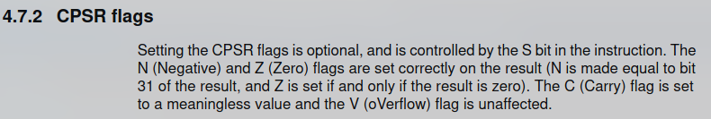

+++ 
title = "Solving the Mystery of ARM7TDMI Multiply Carry Flag"
date = "2024-10-22"
author = "zayd" 
tags = ["dev", "gba", "arm"]
+++

This blog post assumes a base level of knowledge - comfort in the C programming language and bitwise math is recommended. Also, if you ever have any questions, any at all, while reading this blog post, feel free to reach out to me [here](
https://github.com/bmchtech/blog/discussions).

The Gameboy Advance has a pretty neat CPU - the ARM7TDMI. And by neat, I mean a chaotic and
sadistic bundle of questionable design decisions. Seriously, they decided that the program counter should
be a _general purpose register_. Why??? That's like allowing a drunk driver to change their tires while going 30 over the speed limit near a school. I'm not even joking, you can use the program
counter as the output to, say, an XOR instruction. Or an AND instruction.

Or a multiply instruction.

<a name="instructions"></a>
Multiplication on the ARM7TDMI has a few neat features. You can multiply two 32-bit operands together to produce a 64-bit result. You can also optionally choose to do a multiply-add and add a third 64-bit operand to the 64-bit result, within the same instruction. Additionally, you can choose to treat the two 32-bit as either signed or unsigned.

Why are we talking about the multiplication instruction? Well the ARM7TDMI's multiplication instructions have a pretty interesting side effect. Here the manual says that
after a multiplication instruction executes, the carry flag is set to a "meaningless value".



<small>A short description of carry and overflow flags after a multiplication instruction from the ARM7TDMI manual. <sup>[[1](#cite1)]</sup></small>

What this means is that software cannot and
should not rely on the value of the carry flag after multiplication executes. It can be set to anything. Any
value. 0, 1, a horse, whatever. This has been a source of memes in the emulator development community for a few years -
people would frequently joke about how the implementation of the carry flag may as well be `cpu.flags.c =
rand() & 1;`. And they had a point - the carry flag seemed to defy all patterns; nobody understood why it
behaves the way it does. But the one thing we did know, was that the carry flag seemed to be
_deterministic_. That is, under the same set of inputs to a multiply instruction, the flag would be set to the
same value. This was big news, because it meant that understanding the carry flag could give us key
insight into how this CPU performs multiplication.

And just to get this out of the way, the carry flag's behavior after multiplication isn't an important detail to
emulate at all. Software doesn't rely on it. And if software _did_ rely on it, then screw the developers who wrote that software. But the carry flag is a meme, and it's a really tough puzzle, and
that was motivation enough for me to give it a go. Little did I know it'd take _3 years_ of on and off work.

# Standard Algorithm
What's the simplest, most basic multiplication algorithm you can think of to multiply a <span style="color:#3a7dc9"> **multiplier**</span> with a <span style="color:#DC6A76"> **multiplicand**</span>? One really easy way is to
leverage the distributive property of multiplication like so:

$$
\color{#3a7dc9}123\color{#4A4358}  \cdot  \color{#DC6A76}4 \color{#4A4358}=
\color{#3a7dc9}{100 \color{#4A4358} \cdot  \color{#DC6A76}4} \color{#4A4358} + \color{#3a7dc9}{20 \color{#4A4358} \cdot  \color{#DC6A76}4} \color{#4A4358} + \color{#3a7dc9}{3 \color{#4A4358} \cdot  \color{#DC6A76}4}
$$

There's two steps here - first compute the addends, then sum them. This
is the basic two-step process you'll find in lots of multiplication algorithms - most of them simply differ in
how they compute the addends, or how they add the addends together. We can generalize this algorithm
to binary pretty easily too:
$$
\color{#3a7dc9}1101 \color{#4A4358} \cdot \color{#DC6A76}11\color{#4A4358} =
\color{#3a7dc9}{1000 \color{#4A4358} \cdot\color{#DC6A76} 11} \color{#4A4358} + \color{#3a7dc9}{100 \color{#4A4358} \cdot \color{#DC6A76} 11} \color{#4A4358} + \color{#3a7dc9}{0 \color{#4A4358} \cdot\color{#DC6A76} 11} \color{#4A4358} + \color{#3a7dc9}{1 \color{#4A4358} \cdot \color{#DC6A76}11}
$$
The convenient thing about binary is that it's all ones and zeros, meaning the addends are only ever `0`, or
the <span style="color:#DC6A76"> **multiplicand**</span> left shifted by some factor. This makes the addends easy to compute, and means that for
an `N-bit` number, we need to produce `N` different addends, and add them all up to get the result.
That's a lot of addends, which is slow. We can do better.

# Modified Booth's Algorithm
The main slowness of the Standard Algorithm is that it requires you to add a  _lot_ of numbers together.
Modified Booth's algorithm is an improvement on the Standard Algorithm that cuts the number of addends in two. Let's start with the standard definition for multiplication, written as a summation. Note that `m[i]` is defined as the bit at index `i` of `m` when `0 <= i < n`.
$$
\begin{aligned}
\color{#3a7dc9}{m}\color{#4A4358} \cdot \color{#DC6A76} \alpha \color{#4A4358} &= \sum_{i=0}^{n-1} (2^i \cdot \color{#3a7dc9}{m[i]}\color{#4A4358} \cdot \color{#DC6A76} \alpha \color{#4A4358}) \cr
\end{aligned}
$$

Now we apply the following transformations. Yes I know this looks scary, you could skip to [the final equation](#finaleq) if you want.
$$
\begin{align}
\color{#3a7dc9}{m}\color{#4A4358} \cdot \color{#DC6A76} \alpha \color{#4A4358} &= \sum_{i=0}^{n-1} (2^i \cdot \color{#3a7dc9}{m[i]}\color{#4A4358} \cdot \color{#DC6A76} \alpha \color{#4A4358} )\cr\cr
   &\quad\text{Separate the summation into even and odd elements:}\cr \cr
\color{#3a7dc9}{m}\color{#4A4358} \cdot \color{#DC6A76} \alpha \color{#4A4358} &= \sum_{i=0}^{\frac{n}{2}-1} (2^{2i} \cdot \color{#3a7dc9}{m[2i]}\color{#4A4358} \cdot \color{#DC6A76} \alpha \color{#4A4358}) + \sum_{i=0}^{\frac{n}{2}-1}  (2^{2i + 1} \cdot \color{#3a7dc9}{m[2i + 1]}\color{#4A4358} \cdot \color{#DC6A76} \alpha \color{#4A4358}) \cr
\cr&     \quad\text{                        Split the second summation into two more summations:}\cr \cr
\color{#3a7dc9}{m}\color{#4A4358} \cdot \color{#DC6A76} \alpha \color{#4A4358} &= \sum_{i=0}^{\frac{n}{2}-1} (2^{2i} \cdot \color{#3a7dc9}{m[2i]}\color{#4A4358} \cdot \color{#DC6A76} \alpha \color{#4A4358}) + (2 - 1) \cdot \sum_{i=0}^{\frac{n}{2}-1}  (2^{2i + 1} \cdot \color{#3a7dc9}{m[2i + 1]}\color{#4A4358} \cdot \color{#DC6A76} \alpha \color{#4A4358}) \cr 
\color{#3a7dc9}{m}\color{#4A4358} \cdot \color{#DC6A76} \alpha \color{#4A4358} &= \sum_{i=0}^{\frac{n}{2}-1} (2^{2i} \cdot \color{#3a7dc9}{m[2i]}\color{#4A4358} \cdot \color{#DC6A76} \alpha \color{#4A4358}) + 2 \sum_{i=0}^{\frac{n}{2}-1}  (2^{2i + 1} \cdot \color{#3a7dc9}{m[2i + 1]}\color{#4A4358} \cdot \color{#DC6A76} \alpha \color{#4A4358}) - \sum_{i=0}^{\frac{n}{2}-1}  (2^{2i + 1} \cdot \color{#3a7dc9}{m[2i + 1]}\color{#4A4358} \cdot \color{#DC6A76} \alpha \color{#4A4358}) \cr
\color{#3a7dc9}{m}\color{#4A4358} \cdot \color{#DC6A76} \alpha \color{#4A4358} &= \sum_{i=0}^{\frac{n}{2}-1} (2^{2i} \cdot \color{#3a7dc9}{m[2i]}\color{#4A4358} \cdot \color{#DC6A76} \alpha \color{#4A4358}) + \sum_{i=0}^{\frac{n}{2}-1}  (2^{2i + 2} \cdot \color{#3a7dc9}{m[2i + 1]}\color{#4A4358} \cdot \color{#DC6A76} \alpha \color{#4A4358}) - \sum_{i=0}^{\frac{n}{2}-1}  (2^{2i + 1} \cdot \color{#3a7dc9}{m[2i + 1]}\color{#4A4358} \cdot \color{#DC6A76} \alpha \color{#4A4358}) \cr \cr&     \quad\text{                        Pull out a single element from each summation, one at a time:}\cr \cr
\color{#3a7dc9}{m}\color{#4A4358} \cdot \color{#DC6A76} \alpha \color{#4A4358} &= \sum_{i=1}^{\frac{n}{2}-1} (2^{2i} \cdot \color{#3a7dc9}{m[2i]}\color{#4A4358} \cdot \color{#DC6A76} \alpha \color{#4A4358}) + \sum_{i=0}^{\frac{n}{2}-1}  (2^{2i + 2} \cdot \color{#3a7dc9}{m[2i + 1]}\color{#4A4358} \cdot \color{#DC6A76} \alpha \color{#4A4358}) - \sum_{i=0}^{\frac{n}{2}-1}  (2^{2i + 1} \cdot \color{#3a7dc9}{m[2i + 1]}\color{#4A4358} \cdot \color{#DC6A76} \alpha \color{#4A4358}) + (\color{#3a7dc9}{m[0]}\color{#4A4358} \cdot \color{#DC6A76} \alpha \color{#4A4358})\cr
\color{#3a7dc9}{m}\color{#4A4358} \cdot \color{#DC6A76} \alpha \color{#4A4358} &= \sum_{i=1}^{\frac{n}{2}-1} (2^{2i} \cdot \color{#3a7dc9}{m[2i]}\color{#4A4358} \cdot \color{#DC6A76} \alpha \color{#4A4358}) + \sum_{i=0}^{\frac{n}{2}-2}  (2^{2i + 2} \cdot \color{#3a7dc9}{m[2i + 1]}\color{#4A4358} \cdot \color{#DC6A76} \alpha \color{#4A4358}) - \sum_{i=0}^{\frac{n}{2}-1}  (2^{2i + 1} \cdot \color{#3a7dc9}{m[2i + 1]}\color{#4A4358} \cdot \color{#DC6A76} \alpha \color{#4A4358}) + (\color{#3a7dc9}{m[0]}\color{#4A4358} \cdot \color{#DC6A76} \alpha \color{#4A4358} + 2^{n} \cdot \color{#3a7dc9}{m[n - 1]}\color{#4A4358} \cdot \color{#DC6A76} \alpha \color{#4A4358} )\cr
\color{#3a7dc9}{m}\color{#4A4358} \cdot \color{#DC6A76} \alpha \color{#4A4358} &= \sum_{i=1}^{\frac{n}{2}-1} (2^{2i} \cdot \color{#3a7dc9}{m[2i]}\color{#4A4358} \cdot \color{#DC6A76} \alpha \color{#4A4358}) + \sum_{i=0}^{\frac{n}{2}-2}  (2^{2i + 2} \cdot \color{#3a7dc9}{m[2i + 1]}\color{#4A4358} \cdot \color{#DC6A76} \alpha \color{#4A4358}) - \sum_{i=1}^{\frac{n}{2}-1}  (2^{2i + 1} \cdot \color{#3a7dc9}{m[2i + 1]}\color{#4A4358} \cdot \color{#DC6A76} \alpha \color{#4A4358}) + (\color{#3a7dc9}{m[0]}\color{#4A4358} \cdot \color{#DC6A76} \alpha \color{#4A4358} + 2^{n} \cdot \color{#3a7dc9}{m[n - 1]}\color{#4A4358} \cdot \color{#DC6A76} \alpha \color{#4A4358}  + 2 \cdot \color{#3a7dc9}{m[1]}\color{#4A4358} \cdot \color{#DC6A76} \alpha \color{#4A4358} )\cr
\cr&     \quad\text{                        Manipulate the range of the second summation to match the ranges of the other two:}\cr \cr
\color{#3a7dc9}{m}\color{#4A4358} \cdot \color{#DC6A76} \alpha \color{#4A4358} &= \sum_{i=1}^{\frac{n}{2}-1} (2^{2i} \cdot \color{#3a7dc9}{m[2i]}\color{#4A4358} \cdot \color{#DC6A76} \alpha \color{#4A4358}) + \sum_{i=1}^{\frac{n}{2}-1}  (2^{2i} \cdot \color{#3a7dc9}{m[2i - 1]}\color{#4A4358} \cdot \color{#DC6A76} \alpha \color{#4A4358}) - \sum_{i=1}^{\frac{n}{2}-1}  (2^{2i + 1} \cdot \color{#3a7dc9}{m[2i + 1]}\color{#4A4358} \cdot \color{#DC6A76} \alpha \color{#4A4358}) + (\color{#3a7dc9}{m[0]}\color{#4A4358} \cdot \color{#DC6A76} \alpha \color{#4A4358} + 2^{n} \cdot \color{#3a7dc9}{m[n - 1]}\color{#4A4358} \cdot \color{#DC6A76} \alpha \color{#4A4358}  + 2 \cdot \color{#3a7dc9}{m[1]}\color{#4A4358} \cdot \color{#DC6A76} \alpha \color{#4A4358} )\cr
\cr&     \quad\text{                        So that we can combine the summations now:}\cr \cr
\color{#3a7dc9}{m}\color{#4A4358} \cdot \color{#DC6A76} \alpha \color{#4A4358} &= \sum_{i=1}^{\frac{n}{2}-1} (2^{2i} \cdot \color{#3a7dc9}{m[2i]}\color{#4A4358} \cdot \color{#DC6A76} \alpha \color{#4A4358} + 2^{2i} \cdot \color{#3a7dc9}{m[2i - 1]}\color{#4A4358} \cdot \color{#DC6A76} \alpha \color{#4A4358} - 2^{2i + 1} \cdot \color{#3a7dc9}{m[2i + 1]}\color{#4A4358} \cdot \color{#DC6A76} \alpha \color{#4A4358}) + (\color{#3a7dc9}{m[0]}\color{#4A4358} \cdot \color{#DC6A76} \alpha \color{#4A4358} + 2^{n} \cdot \color{#3a7dc9}{m[n - 1]}\color{#4A4358} \cdot \color{#DC6A76} \alpha \color{#4A4358}  + 2 \cdot \color{#3a7dc9}{m[1]}\color{#4A4358} \cdot \color{#DC6A76} \alpha \color{#4A4358} )\cr
\cr&     \quad\text{                       Some tidywork...}\cr \cr
\color{#3a7dc9}{m}\color{#4A4358} \cdot \color{#DC6A76} \alpha \color{#4A4358} &= \sum_{i=1}^{\frac{n}{2}-1} (2^{2i} \cdot \color{#3a7dc9}{m[2i]}\color{#4A4358} \cdot \color{#DC6A76} \alpha \color{#4A4358} + 2^{2i} \cdot \color{#3a7dc9}{m[2i - 1]}\color{#4A4358} \cdot \color{#DC6A76} \alpha \color{#4A4358} - 2 \cdot 2^{2i} \cdot \color{#3a7dc9}{m[2i + 1]}\color{#4A4358} \cdot \color{#DC6A76} \alpha \color{#4A4358}) + (\color{#3a7dc9}{m[0]}\color{#4A4358} \cdot \color{#DC6A76} \alpha \color{#4A4358} + 2^{n} \cdot \color{#3a7dc9}{m[n - 1]}\color{#4A4358} \cdot \color{#DC6A76} \alpha \color{#4A4358}  + 2 \cdot \color{#3a7dc9}{m[1]}\color{#4A4358} \cdot \color{#DC6A76} \alpha \color{#4A4358} )\cr
\color{#3a7dc9}{m}\color{#4A4358} \cdot \color{#DC6A76} \alpha \color{#4A4358} &= \sum_{i=1}^{\frac{n}{2}-1} ((2^{2i} \cdot \color{#DC6A76} \alpha \color{#4A4358} )\cdot(\color{#3a7dc9}{m[2i]}\color{#4A4358} + \color{#3a7dc9}{m[2i - 1]}\color{#4A4358} - 2 \cdot \color{#3a7dc9}{m[2i + 1]}\color{#4A4358} )) + (\color{#3a7dc9}{m[0]}\color{#4A4358} \cdot \color{#DC6A76} \alpha \color{#4A4358} + 2^{n} \cdot \color{#3a7dc9}{m[n - 1]}\color{#4A4358} \cdot \color{#DC6A76} \alpha \color{#4A4358}  + 2 \cdot \color{#3a7dc9}{m[1]}\color{#4A4358} \cdot \color{#DC6A76} \alpha \color{#4A4358} )\cr
\end{align}
$$

Whew. Did you get all of that? Why did we do all this? Well, note this part of the summation:

$$
\begin{aligned}
(\color{#3a7dc9}{m[2i]}\color{#4A4358} + \color{#3a7dc9}{m[2i - 1]}\color{#4A4358} - 2 \cdot \color{#3a7dc9}{m[2i + 1]}\color{#4A4358})
\end{aligned}
$$

This is always one of `(-2, -1, 0, 1, 2)`.

<a name="negation"></a>
Multiplication by those five numbers is easy to calculate in hardware (well, negation is tricky - the algorithm implements negation as bitwise inversion, with an additional 1 added at a later stage. More information about this is given later).

Note also that if we define:

$$
\color{#3a7dc9}{m[-1]}\color{#4A4358} = 0
$$

and

$$
\begin{aligned}
\text{For}&\text{ unsigned multiplication:}\cr\cr
&x \geq n:  \color{#3a7dc9}{m[x]}\color{#4A4358} = 0\cr\cr
\text{For}&\text{ signed multiplication:}\cr\cr
&x \geq n: \color{#3a7dc9}{m[x]}\color{#4A4358} = \color{#3a7dc9}m[n-1]\cr\cr
\end{aligned}
$$


Then the leftover three terms outside the summation can be absorbed into the summation, by expanding the summations range by one on both boundaries. And so we have:

<a name="finaleq"></a>

$$
\begin{aligned}
\color{#3a7dc9}{m}\color{#4A4358} \cdot \color{#DC6A76} \alpha \color{#4A4358} &= \sum_{i=0}^{\frac{n}{2}} ((2^{2i} \cdot \color{#DC6A76} \alpha \color{#4A4358}) \cdot (\color{#3a7dc9}{m[2i]}\color{#4A4358} + \color{#3a7dc9}{m[2i - 1]}\color{#4A4358} - 2 \cdot \color{#3a7dc9}{m[2i + 1]}\color{#4A4358}))\cr
\end{aligned}
$$

Before all this mathematical chaos, we used to have `n` addends. Now we have just over half that many addends. We can model the generation of an addend sans the left shift using the following C code:

```c
// represents a 3-bit chunk that is used to determine an addend's value
typedef u8 BoothChunk;

struct BoothRecodingOutput {
    u64  recoded_output;
    bool carry;
};

// booth_chunk is a 3-bit number representing bits [2i - 1 .. 2i + 1]
// of the multiplier
struct BoothRecodingOutput booth_recode(u64 input, BoothChunk booth_chunk) {
    switch (booth_chunk) {
        case 0: return (struct BoothRecodingOutput) {            0, 0 };
        case 1: return (struct BoothRecodingOutput) {        input, 0 };
        case 2: return (struct BoothRecodingOutput) {        input, 0 };
        case 3: return (struct BoothRecodingOutput) {    2 * input, 0 };
        case 4: return (struct BoothRecodingOutput) { ~(2 * input), 1 };
        case 5: return (struct BoothRecodingOutput) {       ~input, 1 };
        case 6: return (struct BoothRecodingOutput) {       ~input, 1 };
        case 7: return (struct BoothRecodingOutput) {            0, 0 };
    }

    // Note that case 4 can *not* be implemented as 2 * (~input). The reason why
    // is that the real value of the addend as represented by the struct is
    // recoded_output + carry. Doing the inversion after the multiplication by 2
    // will put a 1 in the LSB of the recoded_output, allowing the carry to be
    // added correctly.
}
```
For the curious, more information about Booth Recoding can be found in this resource. <sup>[[2](#cite2)]</sup>

# How to Add Stuff ✨ Efficiently ✨
Now that we have the addends, it's time to actually add them up to produce the result. However, using a
conventional full adder, the ARM7TDMI is only fast enough to add two numbers per cycle. Which means,
you gotta spend 16 cycles to add all 17 addends, which is uselessly slow. The reason full adders are so
slow is because of the carry propagation - bit `N` of the result can't be determined till bit `N - 1` is
determined. Can we eliminate this issue?

Introducing... *drum roll*... carry save adders (CSAs)! These are genius - instead of outputting a single `N-bit` result, CSAs output one `N-bit` result without carry propagation, and one `N-bit` list of carries computed from each bit. At first this seems kind of silly - are CSAs really adding two `N-bit` operands and
producing two `N-bit` results? What's the point? The point is that you can actually fit in an extra operand,
and turn three `N-bit` operands into two `N-bit` results. <sup>[[3](#cite3)]</sup> Like so:
```c
struct CSAOutput {
    u64 output;
    u64 carry;
};

struct CSAOutput perform_csa(u64 a, u64 b, u64 c) {
    // Bit i in result should be set if there is either 1 set bit in 
    // src1/src2/src3 at index i, or 3 set bits in src1/src2/src3 at
    // index i. Similarly, bit i in carries should be set if there's
    // 2 or 3 set bits in src1/src2/src3 at index i. See if you can
    // convince yourself why this is correct.

    u64 output = a ^ b ^ c;
    u64 carry  = (a & b) | (b & c) | (c & a);
    return (struct CSAOutput) { output, carry };
}
```
So you can chain a bunch of CSAs to get yourself down to two addends, and then you can shove the two
`N-bit` results into a regular adder, like so:
```c
u64 add_csa_results(u64 result, u64 carries) {
    // Exercise for the reader: Why do you suppose we multiply
    // carries by 2? Think about how a full adder is implemented,
    // and what the variable "carries" in the perform_csa function
    // above actually represents. The answer is given after this
    // code block.

    return result + carries * 2;
}
```
The reason we multiply `carries` by two is because, if we think about how a full adder works, the carry out
from bit `i` is added to bits `i + 1` of the addends. So, bit `i` of carries has double the "weight" of bit `i` of
result. This is a **very** important detail that will come in handy later, so do make sure you understand
this.

Using CSAs, the ARM7TDMI can sum up the addends together much faster. <sup>[[4, p. 94](#cite4)]</sup>

# Parallelism
Until now, we've mostly treated "generate the addends" and "add the addends" as two separate, entirely
discrete steps of the algorithm. Can we do them at the same time? Turns out, yes! We can generate some number of addends per cycle, and add them together using CSAs in the same cycle. We repeat this process until we've added up all our addends, and then we can send the results from the CSA to the ALU to be added together.

This is what the ARM7TDMI does - it generates four addends per cycle, and compresses
them using four CSAs to generates only two addends.

<center>


</center>

 Each cycle, we read 8 bits from the <span style="color:#3a7dc9"> **multiplier**</span>, and with it, we generate 4 addends. We then
feed them into 4 of the 6 inputs of this CSA array, and when we have our 2 results, feed those
2 results back to the very top of the CSA array for the next cycle. On the first cycle of the algorithm, we can initialize those 2 inputs to the
CSA array with `0`s. 

<a name="trick"> </a>
A clever trick can be done here. The ARM7TDMI [supports mutliply accumulates](#instructions), which perform multiplication and addition in one instruction. We can implement multiply accumulate by initializing one
of those two inputs with the accumulate value, and get multiply accumulate without extra cycles. This trick is what the
ARM7TDMI employs to do multiply accumulate. (This ends up being a moot point, because the CPU is stupid and can only read two register values at a time per cycle. So, using an accumulate causes the CPU to take
an extra cycle _anyway_). <sup>[[4, p.95](#cite4)]</sup>


# Early Termination
The ARM7TDMI does something really clever here. In our current model of the algorithm, there are 4
cycles of CSA compression, where each cycle `i` processes bits `8 * i` to `8 * i + 7` of the <span style="color:#3a7dc9"> **multiplier**</span>. The observation is that if the remaining upper bits of the <span style="color:#3a7dc9"> **multiplier**</span> are all
zeros, then, we can skip that cycle, since the addends produced will be all zeros, which cannot possibly
affect the values of the partial result + partial carry. We can do the same trick if the remaining upper bits
are all ones (assuming we are performing a signed multiplication), as those also produce addends that
are all zeros. <sup>[[4, p.95](#cite4)]</sup>

# Putting it all Together

Here's a rough diagram, provided by Steve Furber in his book, Arm System-On-Chip Architecture:

<a name="diagram"></a>

<small> An image of the high level overview of the multiplier's organization, provided by Steve Furber in his book, Arm System-On-Chip Architecture. <sup>[[4, p.95](#cite4)]</sup> </small>

Partial Sum / Partial Carry contain the results obtained by the CSAs, and are rotated right by 8 on each cycle. Rm is recoded using booth's algorithm to produce the addends for the CSA array. <sup>[[4, p.95](#cite4)]</sup>

Ok, but [remember when I said](#negation) that there will be an elegant way to handle booth's negation of the addends? The way the algorithm gets around this is kind of genius. Remember how the carry output of a CSA has to be left shifted by 1? Well, this left-shift creates a zero in the LSB of the carry output of the CSA, so why don't we just put the carry in that bit? <sup>[[5, p. 12](#cite5)]</sup> Like so:
<a name="perform_csa_array"></a>

```c
struct CSAOutput perform_csa_array(u64 partial_sum, u64 partial_carry, 
                                   struct RecodedMultiplicands addends) {
    struct CSAOutput csa_output = { partial_sum, partial_carry };
    struct CSAOutput final_csa_output = { 0, 0 };

    for (int i = 0; i < 4; i++) {
        csa_output.output &= 0x1FFFFFFFFULL;
        csa_output.carry  &= 0x1FFFFFFFFULL;

        struct CSAOutput result = perform_csa(csa_output.output, 
            addends.m[i].recoded_output & 0x3FFFFFFFFULL, csa_output.carry);

        // Inject the carry caused by booth recoding
        result.carry <<= 1;
        result.carry |= addends.m[i].carry;

        // Take the bottom two bits and inject them into the final output.
        // The value of the bottom two bits will not be changed by future
        // addends, because those addends must be at least 4 times as big
        // as the current addend. By directly injecting these two bits, the
        // hardware saves some space on the chip.
        final_csa_output.output |= (result.output & 3) << (2 * i);
        final_csa_output.carry  |= (result.carry  & 3) << (2 * i);
        
        // The next CSA will only operate on the upper bits - as explained
        // in the previous comment.
        result.output >>= 2;
        result.carry  >>= 2;

        csa_output = result;
    }

    final_csa_output.output |= csa_output.output << 8;
    final_csa_output.carry  |= csa_output.carry  << 8;

    return final_csa_output;
}
``` 

(Yes, this insanity is indeed done by the actual CPU.)

# Fatal Contradiction

Didn't we just finish the section titled "Putting it all Together"? Why then is the scroll bar still halfway down the page?

Because I lied to you all. There's a small, but very meaningful difference between the algorithm I described and
the ARM7TDMI's algorithm. Let's consider the following multiplication:
$$
\color{#3a7dc9}0x000000FF\color{#4A4358}  \cdot  \color{#DC6A76}0x00000001 \color{#4A4358}
$$
How many cycles should this take? 1, right? Because the upper 24 bits of the <span style="color:#3a7dc9"> **multiplier**</span> are zeros, then the
second, third, and fourth cycles of addends will all be zeros... right?
Right? 
Well, that's how long it takes the ARM7TDMI to do it. So what's the issue? Let's take a closer look. The first cycle of the algorithm should have the following four chunks:

$$
\begin{aligned}
&\text{Chunk #1: }\color{#3a7dc9}\text{0b110   (obtained from m[1..-1])}\cr
&\text{Chunk #2: }\color{#3a7dc9}\text{0b111   (obtained from m[3..1])}\cr
&\text{Chunk #3: }\color{#3a7dc9}\text{0b111   (obtained from m[5..3])}\cr
&\text{Chunk #4: }\color{#3a7dc9}\text{0b111   (obtained from m[7..5])}\cr
\end{aligned}
$$

Turns out, in our current version of the algorithm, the second cycle does have a single non-zero addend:

$$
\begin{aligned}
&\text{Chunk #1: }\color{#3a7dc9}\text{0b001   (obtained from m[9..7])}\cr
&\text{Chunk #2: }\color{#3a7dc9}\text{0b000   (obtained from m[11..9])}\cr
&\text{Chunk #3: }\color{#3a7dc9}\text{0b000   (obtained from m[13..11])}\cr
&\text{Chunk #4: }\color{#3a7dc9}\text{0b000   (obtained from m[15..13])}\cr
\end{aligned}
$$
Because the LSB of Chunk #1 of Cycle #2 uses the MSB of Chunk #4 of Cycle #1, our algorithm would be forced to
take 2 cycles of CSAs. And yet, on the ARM7TDMI, this multiplication would terminate early, after only 1 cycle of CSAs. And there doesn't seem to be a good way around this. And so I sat there thinking of
workarounds.

**Proposed solution #1:** What if the ARM7TDMI actually processes 5 chunks per cycle?

**Rebuttal:** If that were the case, then the algorithm would be able to process 9 bits on the first cycle,
which it cannot do.


**Proposed solution #2:** Ok but what if the ARM7TDMI has some way of processing chunk #1 of cycle
`n` on cycle `n - 1`, but only if cycle `n - 1` is the last cycle of the algorithm?

**Rebuttal:** Sure, maybe this is possible, but it feels like any solution that would allow the algorithm to do this would also
be capable of allowing the CPU to do 5 chunks per cycle.


**Proposed solution #3:** Fine, what if the CPU actually leverages the power of Cthulu and evil warlock
magic to pull this off?

**Rebuttal:** Yeah, that's assigning too much credit to this god forsaken bundle of wires that somehow
obtained the title of "CPU" (actually, this solution ends up being closest to the right answer)


I was kind of out of ideas. I was pretty much ready to give up - my current algorithm was nowhere near
explaining the behavior of the CPU carry flag. And so I took a break, only looking at this problem every
once in a while.

# Descent into Madness
Congrats for getting this far, now comes the tricky stuff. I require anyone who wants to continue reading to
put on <a href="https://www.google.com/url?sa=t&source=web&rct=j&opi=89978449&url=https://www.youtube.com/watch?v=ntgaStqpmjQ&ved=2ahUKEwj03pfgvs2IAxWjJTQIHTp_EToQtwJ6BAgIEAI&usg=AOvVaw1qRD2jAXNcY-9YA6Uhb9Ig" target="_blank">this music</a> in the background, as it most accurately models the trek into insanity we are about to endure.

So fast forward about a year, I'm out for a walk and I decide to give this problem a thought again. And so I considered something that, at the outset, sounds really, really stupid.

"What if we left shifted the  <span style="color:#3a7dc9"> **multiplier**</span> by 1 at the beginning of the algorithm?"

I mean, it's kind of dumb, right? The entire issue is that the <span style="color:#3a7dc9"> **multiplier**</span> is _too big_. Left shifting it would only exacerbate this issue. Congrats, we went from being able to process 7 bits on the first cycle to 6.

But pay attention to the **first addend** that would be produced. The corresponding **chunk** would either be `000` or `100`. Two options, both of which are really easy to compute. This is a behavior that would only exist on the first cycle of the algorithm. Coincidentally, if you refer to [the diagram](#diagram) up above, you'll notice that, in the first cycle of the algorithm, we have an extra input in the CSA array that we initialized to zero. What if, instead, we initialize it to the addend produced by this mythical **chunk**? Allowing us to process one additional bit on the first cycle only? <sup>[[5, p. 14](#cite5)]</sup>

It'd solve the issue. It'd get us the extra bit we needed, and make us match the ARM7TDMI's cycle counts completely.

But that's not all. Remember the carry flag from earlier? With this simple change, we go from matching hardware about 50% of the time (no better than randomly guessing) to matching hardware _**85%**_ of the time. This sudden increase was something no other theory was able to do, and made me really confident that I was on to something. However, this percentage only happens if we set the carry flag to bit `30` of the partial carry result, which seems super arbitrary. It turns out that bit of the partial carry result had a special meaning I did not realize at the time, and I would only find out that meaning much, much later.

(Obviously, shifting the <span style="color:#3a7dc9"> **multiplier**</span> left by 1 means the result is now twice what it should be. This is handled later.)

# Mathematical Black Magic

We have a few remaining issues with our implementation of `perform_csa_array`, let's discuss them one at a time.

## Handling 64-bit Accumulates

First of all, we don't know how to handle 64-bit accumulates yet. Thankfully, it was around this time where I found two patents <sup>[[5](#cite5)], [[6](#cite6)] </sup> that ended up being incredibly illuminating. 

We know how to handle 32-bit accumulates - just [initialize the partial sum with the value of the accumulator](#trick). We can use a similar trick for 64-bit ones. First, we can initialize the partial sum with the bottom 33 bits of the 64 bit accumulate. Why 33? I thought the partial sum was 32 bits wide? Well, if we make the width of the partial sum 33 bits, we'd also be able to handle unsigned and signed multiplication by zero / sign extending appropriately. This way, our algorithm itself only needs to be able to perform signed multiplication, and our choice of zero-extension or sign-extension at initialization will handle the rest. More on this in the next section.

We take the remaining 31 bits of the acc and drip-feed them, 2 bits per CSA, like so:

```c
// Contains the current high 31 bits of the acc.
// This is shifted by 2 after each CSA.
u64 acc_shift_register = 0;

struct CSAOutput perform_csa_array(u64 partial_sum, u64 partial_carry,
                                   struct RecodedMultiplicands addends) {
    struct CSAOutput csa_output = { partial_sum, partial_carry };
    struct CSAOutput final_csa_output = { 0, 0 };

    for (int i = 0; i < 4; i++) {
        // ... omitted

        // result.output is guaranteed to have bits 31/32 = 0,
        // so we can safely put whatever we want in them.
        result.output |= (acc_shift_register & 3) << 31;      
        acc_shift_register >>= 2;
    }

    final_csa_output.output |= csa_output.output << 8;
    final_csa_output.carry  |= csa_output.carry  << 8;

    return final_csa_output;
}
```

You can think of this trick conceptually as us initializing all 64-bits of `csa_output.output` to the acc, instead of just the bottom 32-bits. <sup>[[5 p. 14](#cite5)]</sup>

## Handling Signed Multiplication

Turns out this algorithm doesn't support signed multiplication yet either. To implement this, we need to take a closer look at the CSA.

The CSA in its current form takes in 3 33-bit inputs, and outputs 2 33-bit outputs. One of these inputs, however, is actually supposed to be *34* bits (ha, lied to you all again). Specifically, `addends.m[i].recoded_output`. The recoded output is derived from a 32-bit <span style="color:#DC6A76"> **multiplicand**</span>, which, when [booth recoded](#finaleq), can be multiplied by at most `2`, giving it a size of 33 bits. However, because we can support both signed and unsigned multiplies, this value needs to be 34 bits - the extra bit, as mentioned earlier, allows us to choose to either zero-extend or sign-extend the number to handle both signed and unsigned multiplication elegantly.

Let's take a look at the other two of the CSA's addends as well. `csa_output.carry`, a 33 bit number, also needs to be properly sign extended. However, `csa_output.output` does _not_ need to be sign extended, since `csa_output.output` is technically already a 65 bit number that was fully initialized with the acc.

Let's summarize the bit widths so far:
- `csa_output.output`: 65
- `csa_output.carry`: 33 
- `addends.m[i].recoded_output`: 34

In order to implement signed multiplication, we need to sign-extend all 3 of these numbers to the full 65 bits. How can we do so? Well, `csa_output.output` is already 65 bits, so that one is done for us. What about the other two? For now, I will use the following shortened forms for readability:
- `csa_output.output` will be referred to as `S`
- `csa_output.carry` will be referred to as `C` 
- `addends.m[i].recoded_output` will be referred to as `X`


Here's a helpful visualization of these desired 65-bit numbers, after they've been sign extended:
| addend | bits 65-35 | bit 34 | bit 33 | bit 32  | bits 31-0
| -- | - | - | - | - | - |
| `csa_output.output` | S[65..35] | S[34] | S[33] | S[32] | S[31..0] | SL[2i:0] 
| `csa_output.carry` | C[32], ..., C[32] | C[32] | C[32] | C[32] | C[31..0] | CL[2i:0]
| `addends.m[i].recoded_output` | X[33], ..., X[33] | X[33] | X[33] | X[32] | X[31..0] | 0

We can do a magic trick here. We can replace the `csa_output.carry` row with a row of ones, and `!C[32]`. Convince yourself that this is mathematically okay:

| addend | bits 65-35 | bit 34  | bit 33 | bit 32  | bits 31-0
| -- | - | - | - | - | - |
| `csa_output.output` | S[65..35] | S[34] | S[33] | S[32] | S[31..0] | SL[2i:0] 
| `csa_output.carry` | 0, ..., 0 | 0 | !C[32] | C[32] | C[31..0] | CL[2i:0]
| `magic trick` | 1, ..., 1 | 1 | 1 | 0 | 0 | CL[2i:0]
| `addends.m[i].recoded_output` | X[33], ..., X[33] | X[33] | X[33] | X[32] | X[31..0] | 0

Let's do it again, this time to `X`:

| addend | bits 65-35 | bit 34  | bit 33 | bit 32  | bits 31-0
| -- | - | - | - | - |-|
| `csa_output.output` | S[65..35] | S[34] | S[33] | S[32] | S[31..0] | SL[2i:0] 
| `csa_output.carry` | 0, ..., 0 | 0 | !C[32] | C[32] | C[31..0] | CL[2i:0]
| `magic trick` | 1, ..., 1 | 1 | 1 | 0 | 0 | CL[2i:0]
| `addends.m[i].recoded_output` | 0, ..., 0 | 0 | !X[33] | X[32] | X[31..0] | 0
| `another magic trick` | 1, ..., 1 | 1 | 1 | 0 | 0 | CL[2i:0]

Now we add the magic tricks together:

| addend | bits 65-35 | bit 34 | bit 33 | bit 32  | bits 31-0
| -- | - | - | - | - | - |
| `csa_output.output` | S[65..35] | S[34] | S[33] | S[32] | S[31..0] | SL[2i:0] 
| `csa_output.carry` | 0, ..., 0 | 0 | !C[32] | C[32] | C[31..0] | CL[2i:0]
| `addends.m[i].recoded_output` | 0, ..., 0 | 0 | !X[33] | X[32] | X[31..0] | 0
| `combined magic tricks` | 1, ..., 1 | 1 | 0 | 0 | 0 | CL[2i:0]


And we've done it - we removed all the repeated instances of `C[32]` and `X[33]`, using some mathematical black magic. <sup>[[5 pp. 14-17](#cite5)]</sup> This means that all we need to do to handle sign extension is the following two operations:

- `result.output |= (S[33] + !C[32] + !X[32]) << 31;`
- `result.carry  |= (!S[34]) << 32;`

The resulting code:

<a name="perform_csa_array2"></a>

```C
// Contains the current high 31 bits of the acc. 
// This is shifted by 2 after each CSA.
u64 acc_shift_register = 0;

struct CSAOutput perform_csa_array(u64 partial_sum, u64 partial_carry, 
                                   struct RecodedMultiplicands addends[4]) {
    struct CSAOutput csa_output = { partial_sum, partial_carry };
    struct CSAOutput final_csa_output = { 0, 0 };

    for (int i = 0; i < 4; i++) {
        csa_output.output &= 0x1FFFFFFFFULL;
        csa_output.carry  &= 0x1FFFFFFFFULL;
    
        struct CSAOutput result = perform_csa(csa_output.output, 
            addends.m[i].recoded_output & 0x1FFFFFFFFULL, csa_output.carry);

        // Inject the carry caused by booth recoding
        result.carry <<= 1;
        result.carry |= addends.m[i].carry;

        // Take the bottom two bits and inject them into the final output.
        // The value of the bottom two bits will not be changed by future
        // addends, because those addends must be at least 4 times as big
        // as the current addend. By directly injecting these two bits, the
        // hardware saves some space on the chip.
        final_csa_output.output |= (result.output & 3) << (2 * i);
        final_csa_output.carry  |= (result.carry  & 3) << (2 * i);
        
        // The next CSA will only operate on the upper bits - as explained
        // in the previous comment.
        result.output >>= 2;
        result.carry  >>= 2;

        // Perform the magic described in the tables for the sign extension
        // of csa_output.carry and the recoded addend. Remember that bits 0-1
        // of the acc_shift_register is bits 33-34 of S.
        u64 magic = bit(acc_shift_register, 0) + 
            !bit(csa_output.carry, 32) + !bit(addends.m[i].recoded_output, 33);
        result.output |= magic << 31;
        result.carry |= (u64) !bit(acc_shift_register, 1) << 32;        
        acc_shift_register >>= 2;

        csa_output = result;
    }

    final_csa_output.output |= csa_output.output << 8;
    final_csa_output.carry  |= csa_output.carry  << 8;

    return final_csa_output;
}
```

# The Specifics of Early Termination

We already touched on early termination briefly, but turns out it gets a bit more complicated. The patents don't exactly explain how early termination works in much detail, besides some cryptic references to shift types / shift values. But, I gave it my best guess. We know that we have the following condition for early termination:

```c
bool should_terminate(u64 multiplier, enum MultiplicationFlavor flavor) {
    if (is_signed(flavor)) {
        return multiplier == 0x1FFFFFFFF || multiplier == 0;
    } else {
        return multiplier == 0;
    }
}
```

Note that <span style="color:#3a7dc9"> **multiplier**</span> is a signed 33-bit number. After every cycle of booth's algorithm, the bottom eight bits are fed into a result register, since the _next_ cycle of booth's algorithm cannot change the value of those bottom eight bits. The remaining upper bits become the next input into the next cycle of booth's algorithm. Something like this:


```c
// I'm using this over a __uint128_t since the latter isn't available
// on a GBA, and I needed this code to compile on a GBA so I can fuzz the 
// outputs.
struct u128 {
    u64 lo;
    u64 hi;
};

// Latches that contain the final results of the algorithm.
u128 partial_sum;
u128 partial_carry;

do {
    csa_output = perform_one_cycle_of_booths_mutliplication(
        csa_output, multiplicand, multiplier);

    // The bottom 8 bits of this cycle cannot be changed by future
    // addends, since those addends will be at least 256 times as
    // big as this cycle's addends. So, put them into the result
    // latches now.
    partial_sum.lo   |= csa_output.output & 0xFF;
    partial_carry.lo |= csa_output.carry  & 0xFF;

    // Get csa_output ready to be fed back into the CSAs on the next
    // cycle
    csa_output.output >>= 8;
    csa_output.carry  >>= 8;

    // ROR == ROtate Right
    partial_sum = u128_ror(partial_sum, 8);
    partial_carry = u128_ror(partial_carry, 8);

    // ASR == Arithmetic Shift Right for 33-bit numbers
    multiplier = asr_33(multiplier, 8);
} while (!should_terminate(multiplier, flavor));

partial_sum.lo   |= csa_output.output;
partial_carry.lo |= csa_output.carry;
```

Since `partial_sum` and `partial_carry` are shift registers that get rotated with each iteration of booths algorithm, we need to rotate them again after the algorithm ends in order to correct them to their proper values. Thankfully, the ARM7TDMI has something called a barrel shifter. The barrel shifter is a nifty piece of hardware that allows the CPU to perform an arbitrary shift/rotate before an ALU operation, all in one cycle. Since we plan to add `partial_sum` and `partial_carry` in the ALU, we may as well use the barrel shifter to rotate one of those two operands, with no additional cost. The other operand ends up requiring special hardware to rotate, since the barrel shifter only operates on one value per cycle. 

For long (64-bit) multiplies, two right rotations (known on the CPU as RORs) occur, since the ALU can only add 32-bits at a time and so the ALU / barrel shifter must be used twice. 

Spoiler alert, the value of the carry flag after a multiply instruction comes from the carryout of this barrel shifter.

So, what rotation values does the ARM7TDMI use? According to one of the patents, for an unsigned multiply, all (1 for 32-bit multiplies or 2 for 64-bit ones) uses of the barrel shifter do this: <sup>[[6, p. 9](#cite6)]</sup>

| # Iterations of Booths | Type | Rotation | 
| - | - | - |
| 1 |ROR|22 | 
| 2 |ROR|14  |
| 3 |ROR|6  |
| 4 |ROR|30  |

Signed multiplies differ from unsigned multiplies in their **second** barrel shift. The second one for signed multiplies uses Arithmetic Shift Rights (ASRs) and looks like this: <sup>[[6, p. 9](#cite6)]</sup>

| # Iterations of Booths | Type | Rotation | 
| - | - | - |
| 1 |ASR|22 | 
| 2 |ASR|14  |
| 3 |ASR|6  |
| 4 |ROR|30  |

I'm not going to lie, I couldn't make sense of these rotation values. At all. Maybe they were wrong, since they patents already had a couple major errors at this point. No idea. Turns out it doesn't _really_ matter for calculating the carry flag of a multiply instruction. Why? Well, observe what happens when the ARM7TDMI does a `ROR` or `ASR`:

Code from fleroviux's wonderful NanoBoyAdvance. <sup>[[7]](#cite7)</sup>
```C++
void ROR(u32& operand, u8 amount, int& carry, bool immediate) {
  // Note that in booth's algorithm, the immediate argument will be true, and
  // amount will be non-zero

  if (amount != 0 || !immediate) {
    if (amount == 0) return;
    // We end up doing down this codepath

    amount %= 32;
    operand = (operand >> amount) | (operand << (32 - amount));
    carry = operand >> 31;
  } else {
    auto lsb = operand & 1;
    operand = (operand >> 1) | (carry << 31);
    carry = lsb;
  }
}

void ASR(u32& operand, u8 amount, int& carry, bool immediate) {
  // Note that in booth's algorithm, the immediate argument will be true, and
  // amount will be non-zero and less than 32.

  if (amount == 0) {
    // ASR #0 equals to ASR #32
    if (immediate) {
      amount = 32;
    } else {
      return;
    }
  }

  int msb = operand >> 31;

  if (amount >= 32) {
    carry = msb;
    operand = 0xFFFFFFFF * msb;
    return;
  }

  // We end up doing down this codepath
  carry = (operand >> (amount - 1)) & 1;
  operand = (operand >> amount) | ((0xFFFFFFFF * msb) << (32 - amount));
}
```

Note that in both ROR and ASR the carry will always be set to the last bit of the `operand` to be shifted out. i.e., if I rotate a value by `n`, then the carry will always be bit `n - 1` of the `operand` before rotation, since that was the last bit to be rotated out. Same goes for ASR.

So, _it doesn't matter_ if I don't use the same rotation values as the patents. Since, no matter the rotation value, as long as the output from _my_ barrel shifter is the same as the output from the _ARM7TDMI's_ barrel shifter, then the last bit to be shifted out must be the same, and therefore the carry flag must _also_ have been the same.

So, here's my implementation. I tried to somewhat mimic the table from above at the cost of code readability, but I admittedly didn't do a very good job. But hey it works, so fuck it.


```C
// I'm using this over a __uint128_t since the latter isn't available
// on a GBA, and I needed this code to compile on a GBA so I can fuzz the 
// outputs.
struct u128 {
    u64 lo;
    u64 hi;
};

// The final output of multiplication
struct MultiplicationOutput {
    u64 output;
    bool carry;
};

// We have ror'd partial_sum and partial_carry by 8 * num_iterations + 1.
// We now need to ror backwards (rol). I tried my best to mimic the tables, but
// I'm off by one for whatever reason.
int correction_ror;
if (num_iterations == 1) correction_ror = 23;
if (num_iterations == 2) correction_ror = 15;
if (num_iterations == 3) correction_ror = 7;
if (num_iterations == 4) correction_ror = 31;

partial_sum   = u128_ror(partial_sum, correction_ror);
partial_carry = u128_ror(partial_carry, correction_ror);

int alu_carry_in = bit(multiplier, 0);

if (is_long(flavor)) {
    // Did we not early-terminate?
    if (num_iterations == 4) {
        struct AdderOutput adder_output_lo = 
            adder(partial_sum.hi, partial_carry.hi, alu_carry_in);
        struct AdderOutput adder_output_hi = 
            adder(partial_sum.hi >> 32, partial_carry.hi >> 32, 
                  adder_output_lo.carry);

        return (struct MultiplicationOutput) {
            ((u64) adder_output_hi.output << 32) | adder_output_lo.output,
            (partial_carry.hi >> 63) & 1
        };
    } else {
        struct AdderOutput adder_output_lo = 
            adder(partial_sum.hi >> 32, partial_carry.hi >> 32, alu_carry_in);

        int shift_amount = 1 + 8 * num_iterations;

        // Why this is needed is unknown, but the multiplication doesn't work
        // without it
        shift_amount++;

        // Sign extend partial_carry.lo from shift_amount to 64-bits
        partial_carry.lo = sign_extend(partial_carry.lo, shift_amount, 64);
        partial_sum.lo |= acc_shift_register << (shift_amount);

        struct AdderOutput adder_output_hi = 
            adder(partial_sum.lo, partial_carry.lo, adder_output_lo.carry);
        return (struct MultiplicationOutput) { 
            ((u64) adder_output_hi.output << 32) | adder_output_lo.output,
            (partial_carry.hi >> 63) & 1
        };
    }
} else {
    // Did we not early-terminate?
    if (num_iterations == 4) {
        struct AdderOutput adder_output = 
            adder(partial_sum.hi, partial_carry.hi, alu_carry_in);
        return (struct MultiplicationOutput) { 
            adder_output.output,
            (partial_carry.hi >> 31) & 1
        };
    } else {
        struct AdderOutput adder_output = 
            adder(partial_sum.hi >> 32, partial_carry.hi >> 32, alu_carry_in);
        return (struct MultiplicationOutput) { 
            adder_output.output,
            (partial_carry.hi >> 63) & 1
        };
    }
}

```

Anyway, that's basically it. What a meme. If you're interested in the full code, take a look [here](https://github.com/zaydlang/multiplication-algorithm/tree/master).

# References

<a name="cite1"></a>
[1] “Advanced RISC Machines ARM ARM 7TDMI Data Sheet,” 1995. Accessed: Oct. 21, 2024. [Online]. Available: https://www.dwedit.org/files/ARM7TDMI.pdf

<a name="cite2"></a>
[2] “ASIC Design for Signal Processing,” Geoffknagge.com, 2024. https://www.geoffknagge.com/fyp/booth.shtml

<a name="cite3"></a>
[3] Wikipedia Contributors, “Carry-save adder,” Wikipedia, Sep. 17, 2024. https://en.wikipedia.org/wiki/Carry-save_adder

<a name="cite4"></a>
[4] Furber, Arm System-On-Chip Architecture, 2/E. Pearson Education India, 2001.

<a name="cite5"></a>
[5] D. J. Seal, G. Larri, and D. V. Jaggar, “Data Processing Using Multiply-accumulate Instructions,” Jul. 14, 1994

<a name="cite6"></a>
[6] G. Larri, “Data Processing Method And Apparatus Including Iterative Multiplier,” Mar. 11, 1994

<a name="cite7"></a>
[7] fleroviux. "NanoBoyAdvance." GitHub. Available: https://github.com/nba-emu/NanoBoyAdvance.

